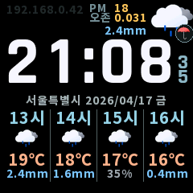
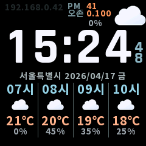

# GeekMagic Open Firmware

Korean-focused firmware for the ESP8266-based **SmallTV-Ultra**.

This fork is based on [Times-Z/GeekMagic-Open-Firmware](https://github.com/Times-Z/GeekMagic-Open-Firmware).

## Preview





## Highlights

- Korean dashboard tuned for SmallTV-Ultra
- Reworked air quality and hourly forecast UI

## Install

Download these files from GitHub Releases:

- `bridge-firmware.bin`
- `firmware.bin`
- `littlefs.bin`
- `SHA256SUMS.txt` (generated by CI)

### From stock firmware

1. Upload `bridge-firmware.bin` from the stock OTA page.
2. Connect to the `GeekMagic` AP.
3. Open `http://192.168.4.1/bridgeupdate`.
4. Upload `firmware.bin`.
5. After reboot, upload `littlefs.bin` from the main firmware update page.

### Direct flash

1. Flash `firmware.bin` to `0x00000000`.
2. Flash `littlefs.bin` to `0x00200000`.
3. If Wi-Fi is not configured, connect to the `GeekMagic` AP and open `http://192.168.4.1/`.

## Build

Requires PlatformIO.

```sh
pio run
pio run -t buildfs
pio run -d tools/bridge-firmware
```

## Tools

- `tools/bridge-firmware`: small OTA bridge firmware for stock upload limits
- `tools/host-exact`: local display preview renderer

## Third-Party Assets

- Firmware source code in this repo is released under `GPL-3.0-or-later`.
- `tools/fontgen/assets/fonts/rajdhani/Rajdhani-Bold.ttf` is bundled under the `SIL Open Font License 1.1`. See `tools/fontgen/assets/fonts/rajdhani/OFL.txt`.
- `src/display/UiTextFont.cpp` is a generated source file checked into this repo. GitHub Actions builds the committed file as-is and does not regenerate it. If you regenerate it locally with `tools/fontgen/generate_ui_text_font.py`, use `Noto Sans KR`.
- `data/web/css/pico.min.css` is `MIT` licensed.
- `data/weather-icons/*.bmp` are generated from [`basmilius/weather-icons`](https://github.com/basmilius/weather-icons) assets. The source icon set is `MIT` licensed.

## License and Upstream

- License: `GPL-3.0-or-later`
- File: `LICENSE`
- Upstream: [Times-Z/GeekMagic-Open-Firmware](https://github.com/Times-Z/GeekMagic-Open-Firmware)
